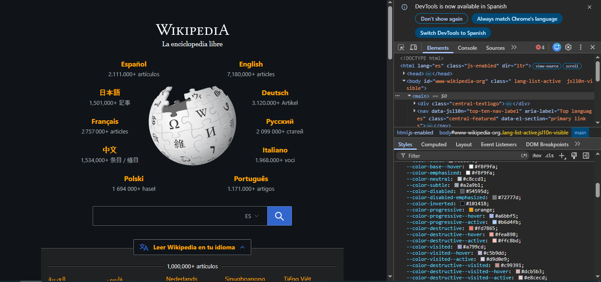
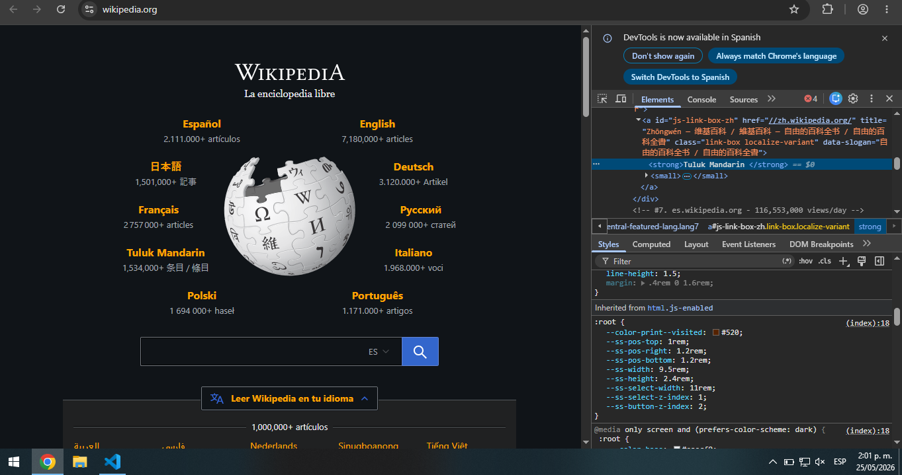
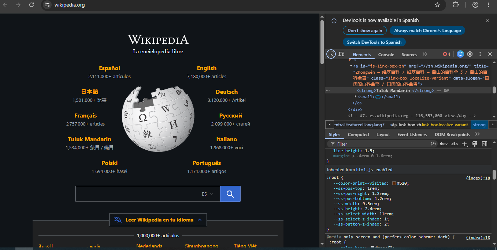
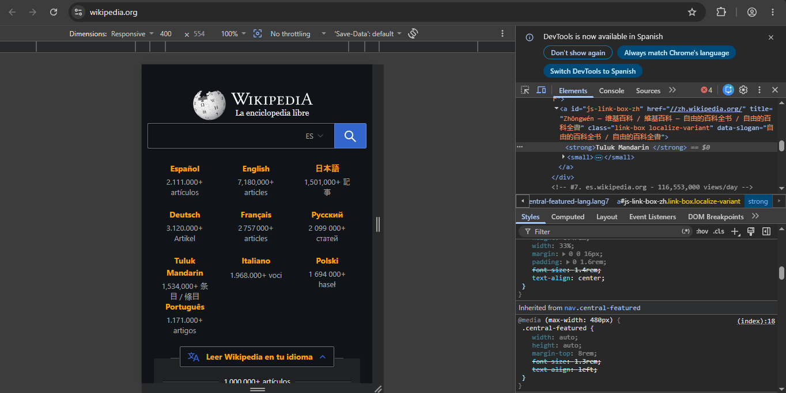

a. 
b.

c. Explicar cómo están compuestos estos módulos de idioma.
Están formados por:
listas <ul>
elementos <li>
enlaces <a>

d. Explicar cómo están colocados.
Usan CSS con:
position
flex
grid
para organizar los idiomas alrededor del logo.

e.
g.

g. Averiguar las dimensiones de la caja de búsqueda.
i. Cuánto tiene de separación con el botón de buscar.
Tiene margen y padding entre el input y el botón.

ii. ¿Qué hay de raro con esa separación?
Parece una sola caja aunque son dos elementos separados.